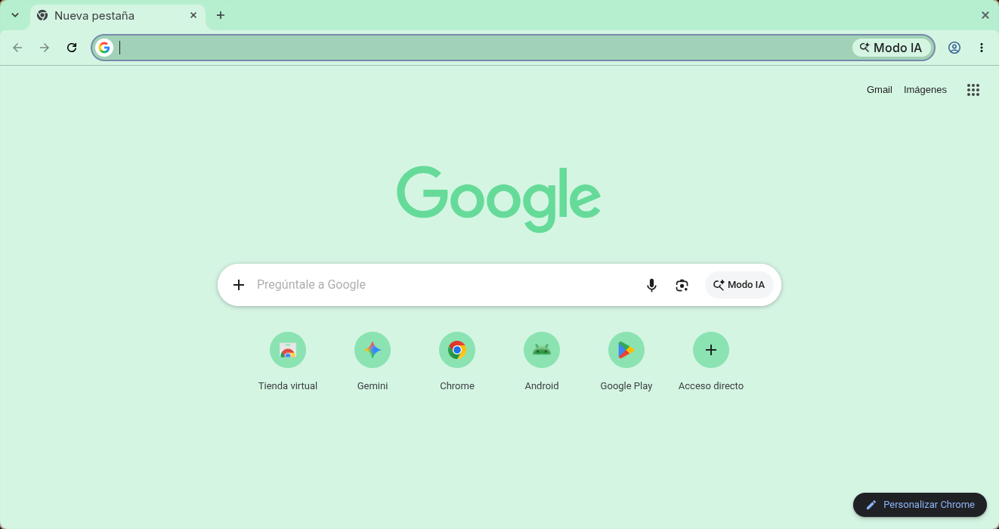

# Minimalist Mint

A minimal Chrome theme in a cool, refreshing palette, by Miguel Euraque.

A soft mint frame, a pale green toolbar and new tab page, and neutral gray text. The palette sits in a cool, refreshing mint that feels clean without being stark.

## Features

- **Palette:** soft mint frame, pale green surfaces, neutral gray text
- **Minimalist design:** clean and uncluttered
- **Easy installation:** Chrome Manifest V3
- **Gentle on the eyes:** low-contrast colors that stay easy to read

## Installation

### Chrome Web Store (recommended)

1. Visit the [Minimalist Mint](https://chromewebstore.google.com/detail/minimalist-mint/anmgojeohcannnhkabfaogkahifmlpkk) page in the Chrome Web Store.
2. Click **Add to Chrome**.

### From source

1. Clone this repository.
2. Open `chrome://extensions` and turn on Developer mode.
3. Click **Load unpacked** and select the theme folder.
